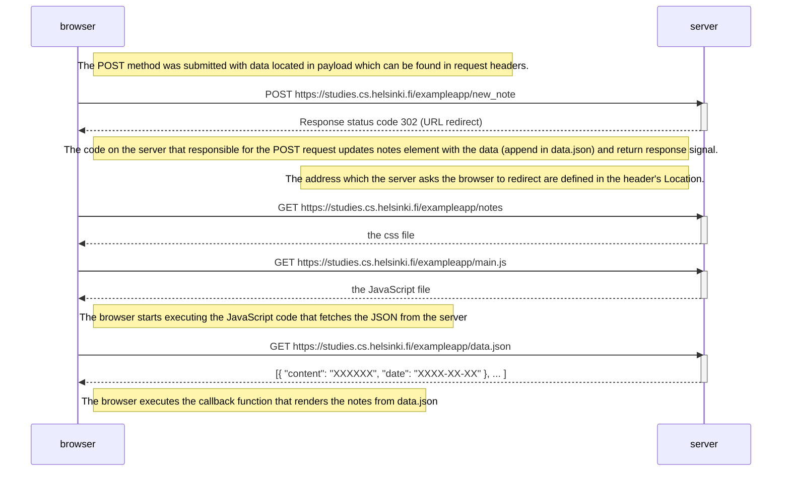

```mermaid
sequenceDiagram
    participant browser
    participant server

    Note right of browser: The POST method was submitted with data located in payload which can be found in request headers.
    browser->>server: POST https://studies.cs.helsinki.fi/exampleapp/new_note
    activate server
    server-->>browser: Response status code 302 (URL redirect)
    deactivate server
    Note left of server : The code on the server that responsible for the POST request updates notes element with the data (append in data.json) and return response signal.
    Note left of server : The address which the server asks the browser to redirect are defined in the header's Location.

    browser->>server: GET https://studies.cs.helsinki.fi/exampleapp/notes
    activate server
    server-->>browser: the css file
    deactivate server

    browser->>server: GET https://studies.cs.helsinki.fi/exampleapp/main.js
    activate server
    server-->>browser: the JavaScript file
    deactivate server

    Note right of browser: The browser starts executing the JavaScript code that fetches the JSON from the server

    browser->>server: GET https://studies.cs.helsinki.fi/exampleapp/data.json
    activate server
    server-->>browser: [{ "content": "XXXXXX", "date": "XXXX-XX-XX" }, ... ]
    deactivate server

    Note right of browser: The browser executes the callback function that renders the notes from data.json
```