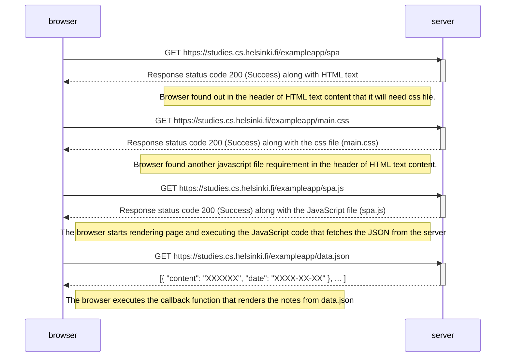

```mermaid
sequenceDiagram
    participant browser
    participant server

    
    browser->>server: GET https://studies.cs.helsinki.fi/exampleapp/spa
    activate server
    server-->>browser: Response status code 200 (Success) along with HTML text
    deactivate server
    Note left of server : Browser found out in the header of HTML text content that it will need css file.

    browser->>server: GET https://studies.cs.helsinki.fi/exampleapp/main.css
    activate server
    server-->>browser:  Response status code 200 (Success) along with the css file (main.css)
    deactivate server
		Note left of server : Browser found another javascript file requirement in the header of HTML text content.

    browser->>server: GET https://studies.cs.helsinki.fi/exampleapp/spa.js
    activate server
    server-->>browser: Response status code 200 (Success) along with  the JavaScript file (spa.js)
    deactivate server

    Note right of browser: The browser starts rendering page and executing the JavaScript code that fetches the JSON from the server

    browser->>server: GET https://studies.cs.helsinki.fi/exampleapp/data.json
    activate server
    server-->>browser: [{ "content": "XXXXXX", "date": "XXXX-XX-XX" }, ... ]
    deactivate server

    Note right of browser: The browser executes the callback function that renders the notes from data.json
```