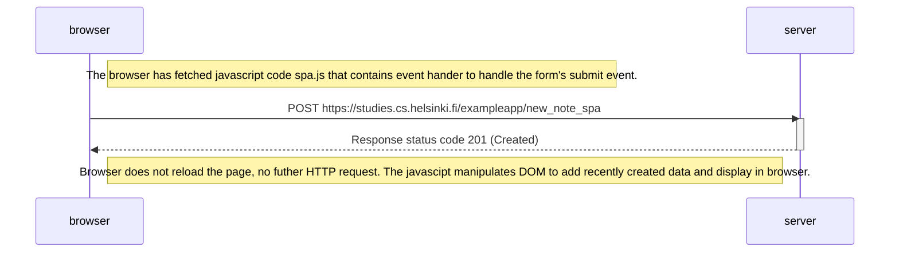

```mermaid
sequenceDiagram
    participant browser
    participant server

		Note right of browser: The browser has fetched javascript code spa.js that contains event hander to handle the form's submit event.
    browser->>server: POST https://studies.cs.helsinki.fi/exampleapp/new_note_spa
    activate server
    server-->>browser: Response status code 201 (Created) 
    deactivate server
    Note right of browser: Browser does not reload the page, no futher HTTP request. The javascipt manipulates DOM to add recently created data and display in browser.

```